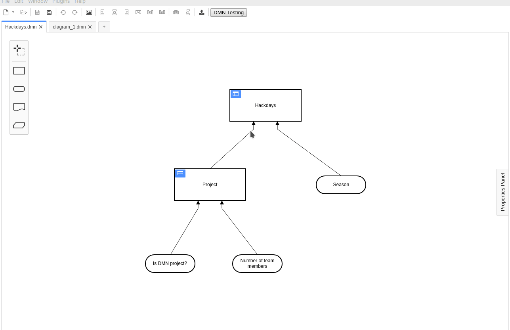

# dmn-testing-plugin

[](https://travis-ci.com/github/bpmn-io/dmn-testing-plugin)
[](https://github.com/camunda/camunda-modeler)

This plugin allows to test DRD diagrams. Currently the plugin supports the following core features:
 * Parsing input variables for a given DRD and decision and letting the user define the respective values. 
 * Starting an embeded lightweight Camunda DMN decision engine as `JAVA` sub-process.
 * Evaluating the DRD with the given input values and displaying the results.



**This plugin is in major version zero** and should therefore not be considered stable. Please refer to [issues](https://github.com/bpmn-io/dmn-testing-plugin/issues) to get an overview of missing features and limitations. 

## How to use

1. Make sure to have `JAVA` installed (required to run the DMN decision engine)
2. Download and copy this repository into the `plugins` directory of the Camunda Modeler
3. Start the Camunda Modeler
4. Start the `Testing` Modal by clicking the respective menu button when having a `.dmn` file open
5. Edit the input parameters as required and start an evaluation by clicking on `Test`

Refer to the [plugins documentation](https://github.com/camunda/camunda-modeler/tree/master/docs/plugins#plugging-into-the-camunda-modeler) to get detailed information on how to create and integrate Camunda Modeler plugins.

## Development Setup

Clone this repository and copy or link the `dmn-testing-plugin` directory to the `plugins` directory of the Camunda Modeler.

Install all dependencies
```sh
$ cd dmn-testing-plugin
$ npm install
```

Perform changes as required.

Build the plugin 
```sh
$ npm run dev
```

Reload or restart the Modeler to make the changes take effect.

## Resources

* [Camunda Modeler plugins documentation](https://github.com/camunda/camunda-modeler/tree/master/docs/plugins#plugging-into-the-camunda-modeler)

## License

MIT